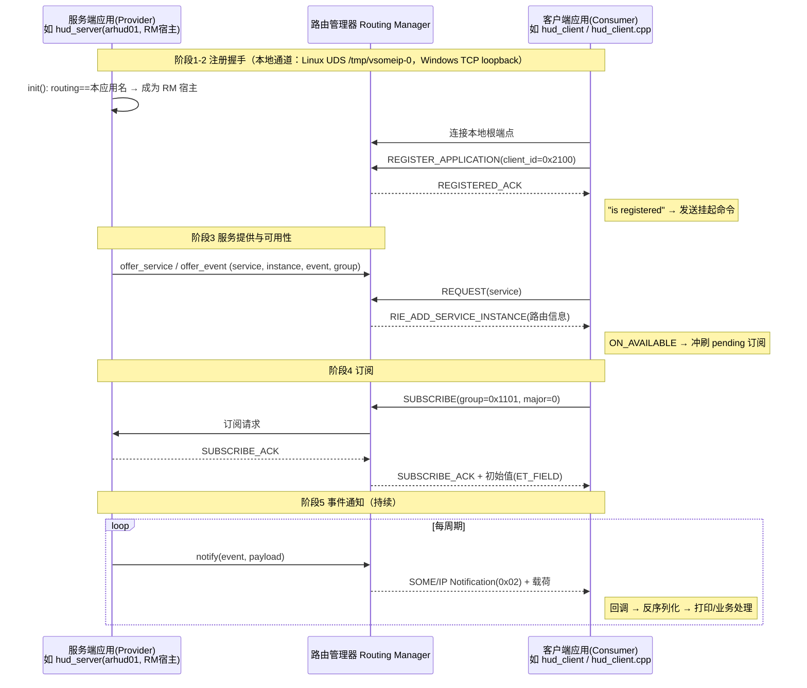

# SOME/IP 双端通信原理详解（服务端 ↔ 客户端）

> 适用范围：本仓库的 vsomeip（COVESA）实现 —— Python（vsomeip_py）与 C++ 客户端，
> 单服务 / 20 服务 / AR-HUD 23 服务场景通用。
> 配套源码参考：`vsomeip_example/`、`hud/`、`hud_cpp/`、`docker/`（全部测试可复现）。

---

## 0. 一句话原理

**服务端把自己提供的服务（Service）通过"路由管理器"广播出去；客户端通过路由管理器
订阅（Subscribe）这些服务的事件；之后服务端每次 notify，数据经路由管理器送达客户端。**
路由管理器（Routing Manager, RM）是双端通信的"中枢"：它负责应用注册、服务路由、
订阅管理和事件转发。

```
┌─────────────┐  本地通道(注册/路由控制)   ┌──────────────────┐  本地通道   ┌─────────────┐
│  服务端应用   │◄──────────────────────────►│   路由管理器 RM    │◄───────────►│  客户端应用   │
│  (Provider) │   服务数据(事件 notify)      │  (Routing Manager)│  服务数据(事件)│ (Consumer)  │
└─────────────┘◄──────────────────────────►└──────────────────┘◄────────────►└─────────────┘
        ▲                                          │
        │       服务发现 SD（多播 224.0.2.4:30490）  │（可选，跨主机/发现用）
        └──────────────────────────────────────────┘
```

---

## 1. 三个核心角色

| 角色 | 说明 | 本仓库对应 |
|---|---|---|
| **服务端（Provider）** | 提供 Service + Instance + Event，用 `offer_service` / `offer_event` 声明，`notify` 发事件 | `hud_server.py`、`server.py`、`hud_server`（C++ 版服务端参考） |
| **客户端（Consumer）** | 用 `request_service` 请求服务、`request_event` + `subscribe` 订阅事件、回调接收 | `hud_client.py`、`client.py`、`hud_client.cpp` |
| **路由管理器（RM）** | 应用注册、服务路由表、订阅管理、事件转发 | vsomeip 库内部（`routing_manager_impl/stub/client`） |

**谁是 RM？** 配置文件 `"routing"` 指定的应用名就是 RM 宿主（没有 vsomeipd 守护进程时）。
本仓库：服务端第一个应用（如 `arhud01`/`arhud_server`）作为 RM 宿主；客户端必须
`routing=<服务端第一个应用名>`，否则客户端会自建 RM，两端"各自为政"。

---

## 2. SOME/IP 协议基础

### 2.1 寻址四元组（SOME/IP 用这四个 ID 唯一定位一个事件）

```
Service ID  (16bit)  服务的类型标识，如 0x000C（车道线服务）
Instance ID(16bit)  服务的实例，如 0x000C（本仓库通常 Instance=Service，0x010A 例外=0x0001）
Event ID   (16bit)  事件标识（Method 高 bit 为 0x8xxx 表示事件），如 0x8003
EventGroup (16bit)  事件组：把多个事件打包成一个订阅单元，如 0x1101
```

订阅以 **EventGroup** 为单位：客户端订阅 group → 服务端该 group 下所有事件都送达。
本仓库 0x000E 服务三个事件分属 0x1101/0x1102/0x1103 三个组（`new_describe.md` 附录B）。

### 2.2 SOME/IP 报文头（16 字节，网络字节序=大端）

| 偏移 | 大小 | 字段 | 说明 |
|---|---|---|---|
| 0 | 2 | Service ID | 服务 |
| 2 | 2 | Method/Event ID | 方法或事件 |
| 4 | 4 | Length | RequestID(4)+Payload 的长度 |
| 8 | 2 | Client ID | 发起方客户端 |
| 10 | 2 | Session ID | 会话（每条消息递增） |
| 12 | 1 | Protocol Version | 0x01 |
| 13 | 1 | Interface Version | 0x01 |
| 14 | 1 | Message Type | 0x00 Request / 0x02 Notification / 0x22 TP 分片 … |
| 15 | 1 | Return Code | 0x00 OK |

> 该头由 vsomeip 库自动封装/解析：**应用层回调里拿到的是纯 Payload**（如 `Checksum/Counter/...`），
> 不需要自己拼头。`pcap_decoder.py` 手工解析头用于抓包核对。

### 2.3 字节序

SOME/IP 头与数据载荷统一 **大端（网络字节序）**。Python `struct '>'`、C++ 显式移位实现；
与主机大小端无关（见 `endian.py` / `hud_cpp/hud_data_types.cpp` 自测）。

---

## 3. 双端通信完整流程（阶段详解 + 时序图）

下面以"服务端提供 1 个服务 1 个事件、客户端订阅"为例（实际 N 个服务同理，流程重复）。

### 阶段 0：配置与启动

- 两端读取同一份配置语义：`applications`（应用名+客户端 ID）、`services`/`clients`（服务与端口）、
  `routing`（RM 宿主）、`service-discovery`（多播）。
- 启动顺序：**先服务端（成为 RM 宿主），后客户端**。

### 阶段 1：RM 宿主选举（仅启动时一次）

```
application_impl::init():
  routing_host = config["routing"]
  is_routing_manager_host_ = (routing_host == 本应用名)   ← 只有名字匹配的应用才是 RM 宿主
```

- 服务端第一个应用名 = `routing` → 它成为 RM 宿主，创建本地根端点（Linux: `/tmp/vsomeip-0`；
  Windows: 127.0.0.1 动态 TCP 端口）；
- 其余应用（含客户端）都是 **RM 代理（proxy）**，通过本地通道连到 RM 根端点。

**失败症状**：`routing` 指向不存在的应用名 → 无 RM 宿主 → 客户端反复 `DEREGISTERED`（Windows）
或 `register timeout`（Linux）。

### 阶段 2：注册握手（应用 ↔ RM，本地通道）

```
客户端(proxy)                         RM(服务端进程)
     │  ① 建本端接收端点 /tmp/vsomeip-<clientid>    │
     │  ② 连 RM 根端点 /tmp/vsomeip-0               │
     │───────────────── REGISTER_APPLICATION ──────►│
     │                                              │  stub::on_register_application
     │◄────────────── REGISTERED_ACK ───────────────│  （记录路由信息、建对端连接）
     │  ③ "is registered" → 发送挂起的请求           │
     │──── REGISTER_EVENT / REQUEST_SERVICE ───────►│
```

- 日志：客户端 `Application/Client 1003 (xxx) is registered.` ⇔ 服务端 `Application/Client 1003 is registering.`

### 阶段 3：服务提供与可用性（Availability）

```
RM(服务端)                              客户端(proxy)
   │ 服务端 offer_service/offer_event        │
   │ 记录 local_services_ + routing_info_    │
   │   （本机服务，不依赖 SD 多播也能被本机找到）│
   │◄──────────── REQUEST(service) ──────────│
   │  find_service → handle_requests         │
   │──── RIE_ADD_SERVICE_INSTANCE(路由信息) ─►│
   │                                         │ on_routing_info:
   │                                         │  ON_AVAILABLE(000c.000c)
   │                                         │  → 冲刷 pending 订阅(要求 major 匹配)
   │◄──────────── SUBSCRIBE(group) ──────────│
```

- 日志：客户端 `ON_AVAILABLE(1003): [000c.000c:0.0]`，服务端 `REQUEST(1003): [1003.000c:...]`。
- 关键约束（实测踩坑）：**subscribe 的 major 版本必须等于服务端 offer 的 major（0）**，
  否则 pending 订阅永不冲刷，事件永远不来。

### 阶段 4：订阅应答（Subscribe ACK）

```
RM(服务端)                                   服务端应用(Provider)
   │ SUBSCRIBE(group) ────────────────────────►│
   │                                           │ 检查事件组→同意
   │◄────────── SUBSCRIBE_ACK ─────────────────│
   │──── SUBSCRIBE_ACK(转发给订阅者) ──────────►│ 客户端收到 ACK
   │──── 初始值(ET_FIELD 字段语义) ────────────►│ 订阅即收到当前值
```

- 日志：客户端 `SUBSCRIBE ACK(1201): [000c.000c.0001.ffff]`。
- 注意：vsomeip 要求**事件组订阅必须开启服务发现**（`SOME/IP eventgroups require SD to be enabled!`），
  即使本机直连也要 `service-discovery.enable=true`。

### 阶段 5：事件通知（数据面，持续）

```
服务端应用                           RM                         客户端
   │ app.notify(event,payload)       │                            │
   │────────────────────────────────►│ 查订阅者 → 转发              │
   │                                 │───────────────────────────►│ 回调 on_message
   │                                 │                            │ → 反序列化打印
```

- 服务端 `notify` 由 vsomeip 封装成 SOME/IP Notification（Type=0x02）发给 RM，
  RM 按订阅表路由到所有订阅该事件组的客户端。
- 日志：服务端 `[send] ...`、客户端 `[recv] ... 已收 X/23`。

### 阶段 6：服务发现（SD，可选，跨主机/动态发现用）

```
服务端(RM 内 SD 模块)                           客户端
   │──周期多播 OFFER(224.0.2.4:30490)──►│  （客户端为 proxy，实际上由 RM 代答）
   │◄──────── 多播/单播 SUBSCRIBE ────────│
```

本机直连时：客户端通过 RM 的**本地路由信息**发现本机服务（阶段 3），不依赖多播；
SD 仅用于跨主机/动态场景。SD 关闭会导致事件组订阅被拒（见阶段 4 注意）。

---

## 4. 双端消息通道总结（一张表）

| 通道 | 方向 | 承载内容 | Linux | Windows |
|---|---|---|---|---|
| 本地控制通道 | 双向 | 注册、路由信息、订阅命令 | Unix Domain Socket `/tmp/vsomeip-<network>-0` | TCP 127.0.0.1（动态端口） |
| 服务数据通道 | 服务端→客户端 | SOME/IP Notification（事件载荷） | UDP 51400-51409/52001（或 TCP） | 同左 |
| 服务发现 | 多播 | SD OFFER/SUBSCRIBE 报文 | UDP 多播 224.0.2.4:30490 | 同左 |

> 注意：**控制通道（注册/路由）始终走本地通道**，与 `reliable`/`unreliable`（服务数据用 TCP 还是 UDP）无关。
> 这也是早期报告"use-tcp 无法解决注册问题"的原因。

---

## 5. 数据序列化（载荷层）

- 载荷 = 自定义结构体（大端），从 `Checksum(uint32)` + `Counter(uint16)` 开头（HUD 场景）；
- 字符串：`长度(uint32)=3+BOM+内容`，BOM=`EF BB BF`；
- 动态数组：`长度(uint32)=字节数`，元素数=长度÷元素大小；
- Python 端 `hud/hud_data_types.py` 与 C++ 端 `hud_cpp/hud_data_types.cpp` 字节级一致
  （跨语言已实测：Python 服务端 ⇄ C++ 客户端 23/23）。

---

## 6. 本项目三种场景的完整链路

### 6.1 单服务（`server.py` + `client.py`）
```
server.py(arhud_server=RM宿主, 0x000C/0x8003) ──注册──► RM
client.py(routing=arhud_server, 0x000C) ──注册──► RM ──请求/订阅──► server
server 回放 pcap → notify(0x8003) → RM → client 反序列化打印
```

### 6.2 20 服务（`server_multi.py` + `client_multi.py`）
```
server_multi: 20 个应用各 offer 1 个服务(0x0100+i)，第一个 arhud_svc_0 是 RM 宿主
client_multi: 20 个应用各订阅 1 个服务（vsomeip_py 包装层限制：1 对象=1 服务）
等价于 1 个进程内 40 个应用 + 1 个 RM，注册/订阅流程重复 20 次
C++ 单应用版（min_cli_multi/min_svc_multi）：1 个应用搞定全部，资源开销更小
```

### 6.3 HUD 23 服务（`hud_server.py` + `hud_client.py` / `hud_client.cpp`）
```
hud_server: 11 个应用（第一个 arhud01=RM宿主），23 个事件，端口/实例按修正表
hud_client.py: 11 个应用订阅 23 事件（0x000E 三事件组不同）
hud_client.cpp: 1 个应用订阅 23 事件（标准 vsomeip 用法）
数据流：hud_server ──notify(23事件)──► RM ──► 客户端回调 ──deserialize──► 打印
```

---

## 7. 关键日志 ↔ 阶段对照（排障用）

| 日志（客户端） | 所处阶段 | 正常 |
|---|---|---|
| `Instantiating routing manager [Host].` | 阶段1 | 只有 RM 宿主（服务端）打印 |
| `Instantiating routing manager [Proxy].` | 阶段1 | 客户端打印 |
| `Application/Client xxxx (name) is registered.` | 阶段2 | 注册成功 |
| `ON_AVAILABLE(...): [svc.inst:major.minor]` | 阶段3 | 服务可用 |
| `SUBSCRIBE ACK(...)` | 阶段4 | 订阅成功 |
| `[recv] ... 已收 X/23` | 阶段5 | 收到事件 |

| 异常日志 | 卡在 | 修复 |
|---|---|---|
| `register timeout! Trying again...` / 反复 `DEREGISTERED` | 阶段1/2 | `routing` 指向真实应用名；清 `/tmp/vsomeip-*`；先服务端后客户端 |
| `Couldn't connect to: /tmp/vsomeip-0` | 阶段2 | 服务端没起来/不是 RM 宿主；检查 `[Host]` 日志 |
| 无 `ON_AVAILABLE` | 阶段3 | 服务端 offer 的服务/实例/事件与客户端请求不一致；构造函数第 2 参数应为服务 ID |
| 有 `ON_AVAILABLE` 但无事件 | 阶段4/5 | subscribe major 与服务端 offer major 一致(0)；SD 开启；事件组一致；服务端发送预算别太小 |
| `SOME/IP eventgroups require SD to be enabled!` | 阶段4 | `service-discovery.enable=true`（键名是 enable 不是 enabled） |
| 载荷"解析失败" | 阶段5 | 字节序/格式与文档不一致：`hud_data_types.py` 顶部常量；`pcap_decoder.py --dump` 核对 |

---

## 8. 常见理解误区

1. **"路由管理器通信走 UDS 是 bug"** —— 不是 bug，是架构设计（Windows 上是 TCP loopback）；
2. **"客户端连上 /tmp/vsomeip-0 就能收数据"** —— 连上只代表注册通道通，还必须
   request_service（可用性）→ subscribe（订阅）→ 服务端 notify，缺一不可；
3. **"服务发现关闭能省事"** —— 事件组订阅要求 SD 开启；本机直连虽不靠多播发现，但 SD 必须 enabled；
4. **"一个应用只能服务一个服务"** —— vsomeip（C++）一个应用可服务/订阅任意多服务；
   限制只存在于 vsomeip_py 薄包装层。

---

## 9. 参考

- 仓库内：`SOLUTION.md` / `SOLUTION_WINDOWS.md` / `SOLUTION_HUD.md` / `TUTORIAL.md`
- vsomeip 源码（3.4.10）：`routing_manager_impl/stub/client.cpp`、`application_impl.cpp`
- COVESA：https://github.com/COVESA/vsomeip 、https://github.com/COVESA/vsomeip_py
- AUTOSAR SOME/IP 规范：SOME/IP Protocol Specification（Message ID/Length/Request ID/Type 等）

---

## 10. 完整时序图（Mermaid，GitHub 自动渲染）


